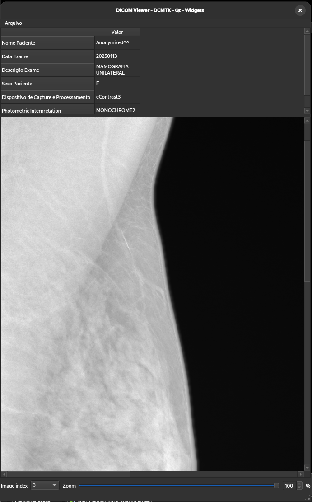

# dicom_viewer-dcmtk-qt-widgets
DICOM Image Viewer with DCMTK and Qt Widgets

Developed with C++23 and Qt Creator IDE (https://doc.qt.io/qtcreator/).

## Features
- Image viewer with auto-scalling and zoom control (screens/screen-1.png);
- Main DICOM properties.


## Depends on :
- Qt6 (https://www.qt.io) for GUI;
- DCMTK (https://dicom.offis.de/dcmtk) for DICOM suport.

## Containerized build dependencies :
- podman (https://github.com/containers/podman).

Podman offers rootless alternative over docker, and is fully "cli" compliance.

## Build and Run process
- Open terminal and clone this repository with :
```
git clone https://github.com/alexsandrostefenon/dicom_viewer-dcmtk-qt-widgets;
cd dicom_viewer-dcmtk-qt-widgets;
```
- Edit Dockerfile with your host arquiteture (use 'sudo' to prefix comands with ubuntu and other sudo based systems);
- Build image
```
podman build -t qt6-dcmtk-dev -f Dockerfile
```
- Build aplication executable binary
```
podman run -it --rm -v "${PWD}:/project" -w /project --user '0:0' qt6-dcmtk-dev sh -c 'qmake6 && make'
```
- Above parameter "--user '0:0'" is not need in not "sudo" system.
- In host, install qt6, dcmtk runtime libraries like
```
apt-get install dcmtk libqt6gui6 libqt6widgets6 libqt6core6t64;
```
- Run application
```
./qt_widgets_dcmtk_viewer
```

## Pendencies
- Fix image index change in multi-image dicom file;
- Add Window Level / Window Width features;
- Fix mingw/win32/win64 cross-compile Dockerfile.mingw;
- Do emcc/wasm/web cross-compile Dockerfile.emcc;
